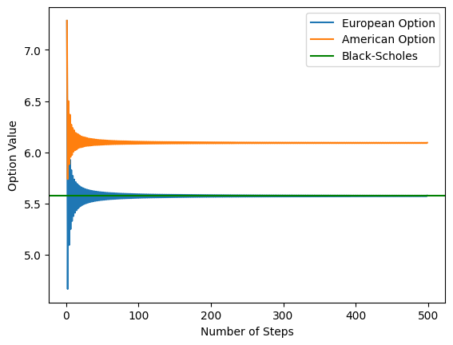

# Binomial Option Pricer

A Cox-Ross-Rubinstein binomial tree pricer for European and American
options, written in NumPy. Includes Greeks by finite difference and a
Black-Scholes reference implementation for validation.

## Features

- European and American exercise
- Calls and puts
- CRR parameterization: `u = exp(σ√Δt)`, `d = 1/u`
- Greeks: delta, gamma, vega, theta
- Black-Scholes closed form for comparison
- No-arbitrage guard on the risk-neutral probability

## Setup

Requires Python 3.9+ and three packages:

```bash
pip install numpy scipy matplotlib
```

`numpy` for the tree, `scipy` for the normal CDF in Black-Scholes, and
`matplotlib` for the charts.

## Usage

```python
option = Option_Pricer(s0=100, K=100, T=1, r=0.05, sigma=0.2,
                       n=500, opt="c", style="european")
option.opt_price(500)
option.delta()
```

## Method

Terminal stock prices are computed directly as `s0 * u^j * d^(n-j)`, then
converted to payoffs for the given strike and option type. Backward
induction then works from the last step (n) to step 0, which holds the
price today. Each node's value is the discounted, risk-neutral-weighted
average of its two children:

    e^(-rΔt) [ p·V_up + (1-p)·V_down ]

The risk-neutral probability `p` is the weight that makes the stock's
expected growth equal the risk-free rate. It is not a forecast: the
option's value equals the cost of a portfolio of stock and cash that
reproduces its payoff, and `p` is the algebraic rearrangement of that
replication result.

## Validation

| Check | Result |
|---|---|
| Hand-built 3-step tree | 7.475, matches at every node |
| Hull worked example | 1.2823 call / 1.0592 put |
| Put-call parity | Holds to machine precision at all `n` |
| Convergence to Black-Scholes | 10.4466 at `n=500` vs 10.4506 analytic |
| American call = European call | Identical, as theory requires |
| American put > European put | Gap 0.5193 at `r=5%`, widening with `r` |
| Delta vs analytic | 0.63677 vs 0.63683 |
| Vega vs analytic | 37.5052 vs 37.5240 |
| Theta vs analytic | −0.017567 vs −0.017573 per day |



An option's payoff has a sharp corner at the strike price. When the
number of steps is even there is a node sitting exactly at K (here,
because K = s0); when it is odd, the strike falls between two nodes.
The price therefore alternates between being a notch too high and a
notch too low depending on the step count, rather than converging
smoothly.

[Greeks]


**Delta** is computed as the slope of the option value with respect to
the stock price. It follows the shape of a cumulative distribution
function: at low stock prices the put's delta approaches −1, so the
option moves almost one-for-one against the stock.

**Gamma** is the slope of the delta curve. It peaks as the stock
approaches the strike, which is where delta changes fastest.

**Vega** is the change in price per unit of volatility. Near the strike,
a change in volatility could leave the option far in or far out of the
money, so volatility matters more there than anywhere else — hence the
peak.

**Theta** measures the effect of time passing. Far out of the money the
value barely moves, since there is little value left to lose. Far in the
money with `r > 0`, theta is positive: exercise is near-certain, so the
put behaves like a claim on the strike at expiry, and as expiry
approaches that claim is discounted less. Setting `r = 0` removes the
discount and the positive region disappears, confirming the cause. The
most negative theta sits slightly out of the money, where uncertainty
about the outcome is greatest.

## Model limits

The tree requires `d < exp(rΔt) < u`, which under CRR reduces to

    r·√Δt < σ

If violated, the risk-neutral probability falls outside [0, 1] and the
model returns meaningless prices without error. Example: `r=0.5`,
`σ=0.02`, `n=1` gives `p = 16.71` and a price of −18.87.

A guard raises `ValueError` when `p` leaves [0, 1].

Note this depends on `n`: the same `r` and `σ` can be invalid on a
coarse tree and valid on a fine one, since `√Δt` shrinks as steps are
added.

## Known issue: gamma

Gamma by central difference on `s0` is unstable, because a binomial
tree's price is not smooth in `s0` — the lattice shifts rather than
sliding along a curve.

| h | Gamma |
|---|---|
| 0.01 | 3.354568 |
| 0.1 | 0.335457 |
| 0.5 | 0.067091 |
| 1 | 0.033546 |
| 2 | 0.020309 |
| Black-Scholes | 0.018762 |

The value does not converge as `h` shrinks; it diverges. The proper fix
is to read gamma off the tree's own nodes at step 2 rather than
repricing. Not implemented.

## Not implemented

- Dividends
- Implied volatility
- Tree-node Greeks

## References

- Hull, J. *Options, Futures and Other Derivatives* — chapter on binomial trees.
- Cox, J., Ross, S. and Rubinstein, M. (1979). "Option Pricing: A Simplified Approach."
- Lo, A. *Options, Part III*, 15.401 Finance Theory I, MIT OpenCourseWare.
  https://ocw.mit.edu/courses/15-401-finance-theory-i-fall-2008/
